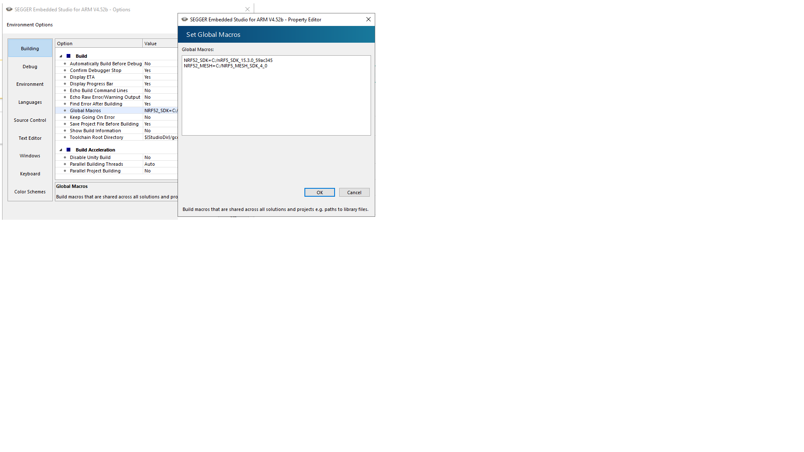
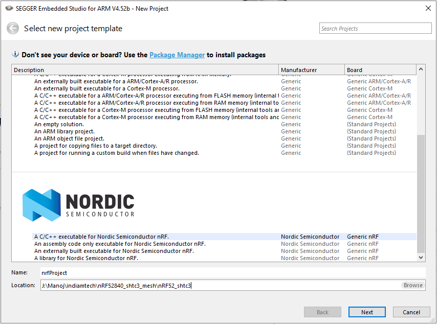
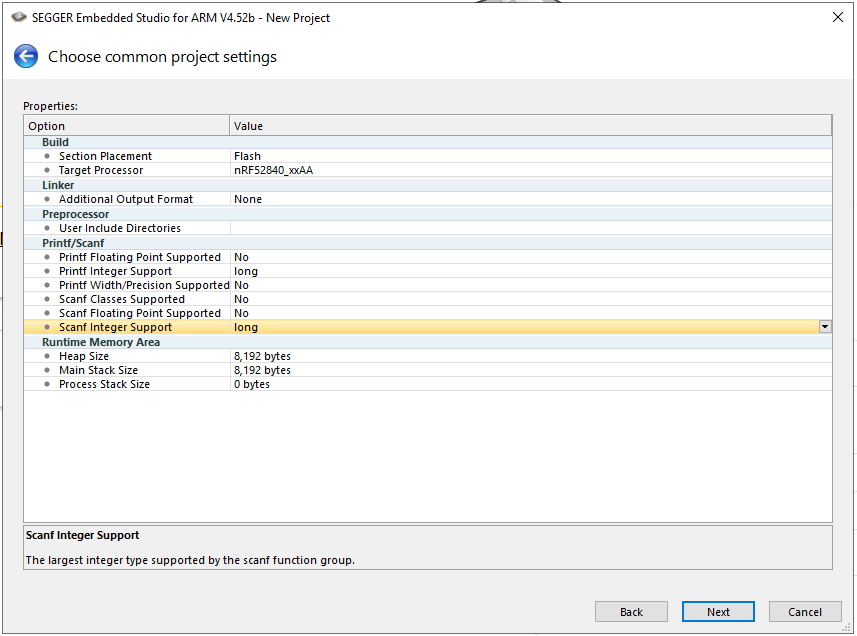
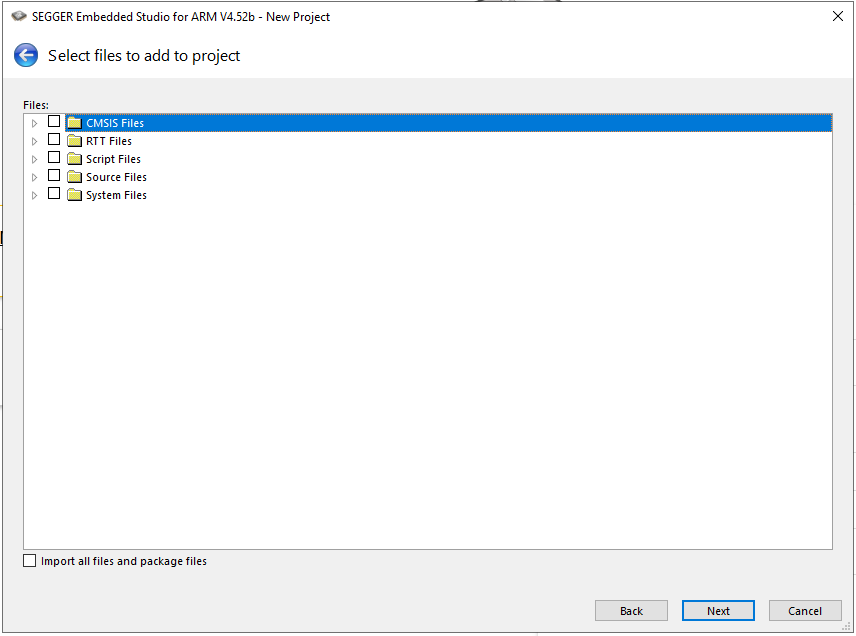
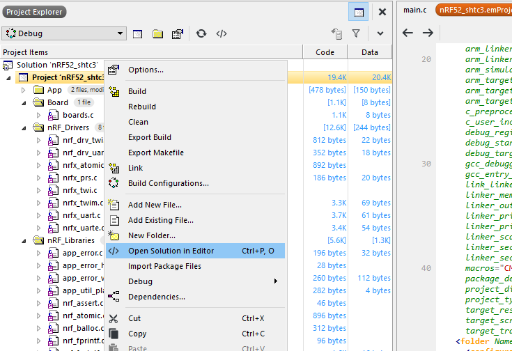
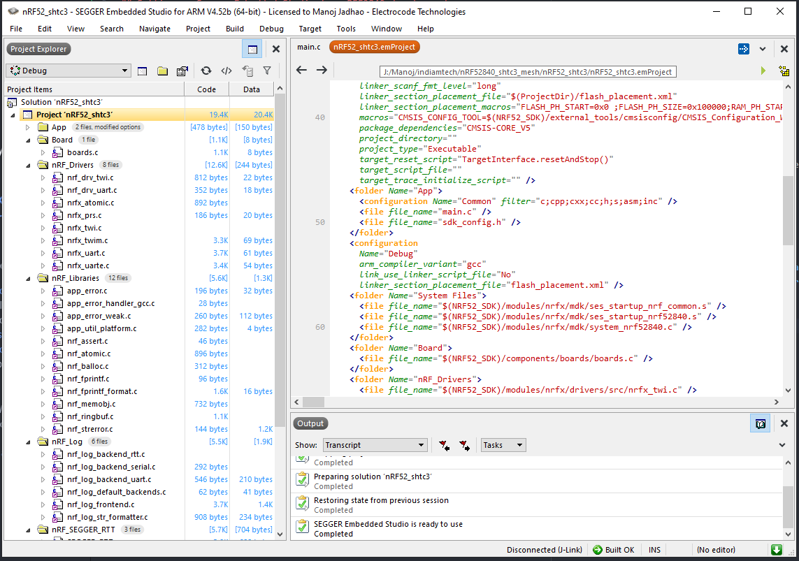
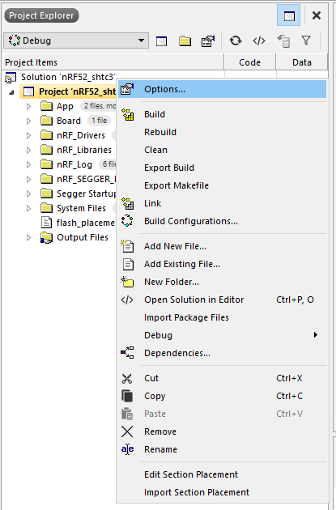
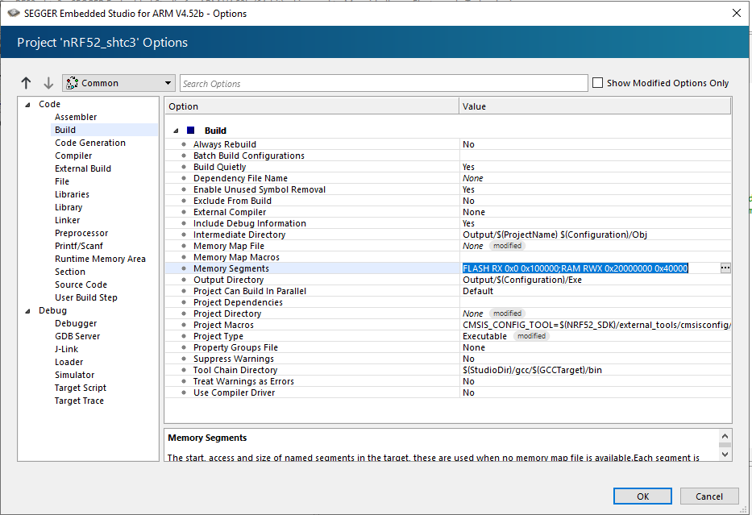
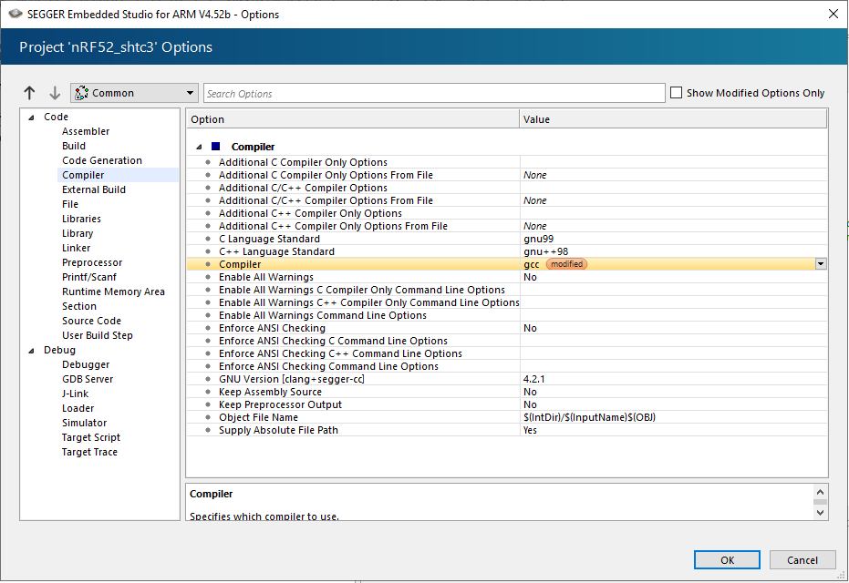

# nRF52_shtc3

## Setting up Segger Embedded Studio for nRF52840 development

### Follow these step to install required software and SDK

1. Install Segger Embedded Studio for ARM 4.52b
2. Activate free license for Nordic Semiconductors development
3. Download nRF5 SDK V 15.3.0 and extract it to a short address of drive.
    e.g. (*C:\nRF5_SDK_15.3.0*)

### Setup Segger Studio Environment
1. Open Segger Embedded Studio we installed.
2. Go to Tab **Tools->Building**, under **Build** look for **Global Macros**, insert the nRF5 SDK address to assign a variable to it. e.g.(*NRF52_SDK=C:/nRF5_SDK_15.3.0*)
3. Now we can use this variable globally in our projects. 

### Creating nrf5 project
1. Click on *Create New* project.
2. If Nordic Semiconductors package is not installed, install it.
3. Select C/C++ executable project, enter project name and location as shown. 
4. Click *Next*. Select **Target processor**. Enter settings as shown. e.g.(*nRF52840_xxAA*). Click *Next*.
5. Uncheck all folders. We will include them from SDK directly. Uncheck *Import all files and package files*.
6. Click *Next* and then *Finish*.

### Configure project to be used with nRF5 V 15.3.0 SDK
1. Right click on project from *Project Explorer*. Select *Open Solution in Editor*.
2. Add code below using *<folder></folder>* tag as shown after *<configuration />* to get stared faster OR can be added manually. 
    `<folder Name="System Files">
      <file file_name="$(NRF52_SDK)/modules/nrfx/mdk/ses_startup_nrf_common.s" />
      <file file_name="$(NRF52_SDK)/modules/nrfx/mdk/ses_startup_nrf52840.s" />
      <file file_name="$(NRF52_SDK)/modules/nrfx/mdk/system_nrf52840.c" />
    </folder>
    <folder Name="Board">
      <file file_name="$(NRF52_SDK)/components/boards/boards.c" />
    </folder>
    <folder Name="nRF_Drivers">
      <file file_name="$(NRF52_SDK)/modules/nrfx/drivers/src/nrfx_twi.c" />
      <file file_name="$(NRF52_SDK)/modules/nrfx/drivers/src/nrfx_twim.c" />
      <file file_name="$(NRF52_SDK)/modules/nrfx/drivers/src/nrfx_uart.c" />
      <file file_name="$(NRF52_SDK)/modules/nrfx/drivers/src/nrfx_uarte.c" />
      <file file_name="$(NRF52_SDK)/modules/nrfx/drivers/src/prs/nrfx_prs.c" />
      <file file_name="$(NRF52_SDK)/modules/nrfx/soc/nrfx_atomic.c" />
      <file file_name="$(NRF52_SDK)/integration/nrfx/legacy/nrf_drv_twi.c" />
      <file file_name="$(NRF52_SDK)/integration/nrfx/legacy/nrf_drv_uart.c" />
    </folder>
    <folder Name="nRF_Libraries">
      <file file_name="$(NRF52_SDK)/external/fprintf/nrf_fprintf.c" />
      <file file_name="$(NRF52_SDK)/external/fprintf/nrf_fprintf_format.c" />
      <file file_name="$(NRF52_SDK)/components/libraries/strerror/nrf_strerror.c" />
      <file file_name="$(NRF52_SDK)/components/libraries/ringbuf/nrf_ringbuf.c" />
      <file file_name="$(NRF52_SDK)/components/libraries/memobj/nrf_memobj.c" />
      <file file_name="$(NRF52_SDK)/components/libraries/balloc/nrf_balloc.c" />
      <file file_name="$(NRF52_SDK)/components/libraries/atomic/nrf_atomic.c" />
      <file file_name="$(NRF52_SDK)/components/libraries/util/app_error.c" />
      <file file_name="$(NRF52_SDK)/components/libraries/util/app_error_handler_gcc.c" />
      <file file_name="$(NRF52_SDK)/components/libraries/util/app_error_weak.c" />
      <file file_name="$(NRF52_SDK)/components/libraries/util/app_util_platform.c" />
      <file file_name="$(NRF52_SDK)/components/libraries/util/nrf_assert.c" />
    </folder>
    <folder Name="nRF_Log">
      <file file_name="$(NRF52_SDK)/components/libraries/log/src/nrf_log_backend_rtt.c" />
      <file file_name="$(NRF52_SDK)/components/libraries/log/src/nrf_log_backend_serial.c" />
      <file file_name="$(NRF52_SDK)/components/libraries/log/src/nrf_log_backend_uart.c" />
      <file file_name="$(NRF52_SDK)/components/libraries/log/src/nrf_log_default_backends.c" />
      <file file_name="$(NRF52_SDK)/components/libraries/log/src/nrf_log_frontend.c" />
      <file file_name="$(NRF52_SDK)/components/libraries/log/src/nrf_log_str_formatter.c" />
    </folder>
    <folder Name="nRF_SEGGER_RTT">
      <file file_name="$(NRF52_SDK)/external/segger_rtt/SEGGER_RTT.c" />
      <file file_name="$(NRF52_SDK)/external/segger_rtt/SEGGER_RTT_printf.c" />
      <file file_name="$(NRF52_SDK)/external/segger_rtt/SEGGER_RTT_Syscalls_SES.c" />
    </folder>
    <folder Name="Segger Startup file">
      <file file_name="$(StudioDir)/source/thumb_crt0.s" />
    </folder>`
    
3. Now all required driver source files are added to this project. Now you should source file *main.c* in project.
4. Add *sdk_config.h* and edit as per requirement. Sample can be found in *SDK->config->* **Processor** *->config*.
5. Copy file *flash_placement.xml* from *SDK->config>* **Processor** *->ses* to project, use it for *section placement*.
6. In *Project Explorer* right click on project, click on **Options**.
7. Select configuration **Common**.
  1. Under **Code** select **Build**.
  2. Enter *Memory Segment* -> `FLASH RX 0x0 0x100000;RAM RWX 0x20000000 0x40000`.
  3. Enter *Project Macros* -> `CMSIS_CONFIG_TOOL=$(NRF52_SDK)/external_tools/cmsisconfig/CMSIS_Configuration_Wizard.jar`.
    
  4. Select **Compiler**, set compiler option to _gcc_.
  5. Select **Linker**, set *Linker* to _GNU_. Set *Section Placement Macros* with
  `FLASH_PH_START=0x0
   FLASH_PH_SIZE=0x100000
   RAM_PH_START=0x20000000
   RAM_PH_SIZE=0x40000
   FLASH_START=0x0
   FLASH_SIZE=0x100000
   RAM_START=0x20000000
   RAM_SIZE=0x40000` [Linker Config](images/linkerCfg.png)
  6. Select **Preprocessor**.[Adding Preprocessor](images/preprocessorCfg.png)
    1. Enter *Preprocessor Definitions* with
        `BOARD_PCA10056
         BSP_DEFINES_ONLY
         CONFIG_GPIO_AS_PINRESET
         FLOAT_ABI_HARD
         INITIALIZE_USER_SECTIONS
         NO_VTOR_CONFIG
         NRF52840_XXAA`
    2. Set **User Include Directories** with
        `$(ProjectDir)/config
        $(NRF52_SDK)/components
        $(NRF52_SDK)/components/boards
        $(NRF52_SDK)/components/drivers_nrf/nrf_soc_nosd
        $(NRF52_SDK)/components/libraries/atomic
        $(NRF52_SDK)/components/libraries/balloc
        $(NRF52_SDK)/components/libraries/bsp
        $(NRF52_SDK)/components/libraries/delay
        $(NRF52_SDK)/components/libraries/experimental_section_vars
        $(NRF52_SDK)/components/libraries/log
        $(NRF52_SDK)/components/libraries/log/src
        $(NRF52_SDK)/components/libraries/memobj
        $(NRF52_SDK)/components/libraries/ringbuf
        $(NRF52_SDK)/components/libraries/strerror
        $(NRF52_SDK)/components/libraries/util
        $(NRF52_SDK)/components/toolchain/cmsis/include
        $(NRF52_SDK)/external/fprintf
        $(NRF52_SDK)/external/segger_rtt
        $(NRF52_SDK)/integration/nrfx
        $(NRF52_SDK)/integration/nrfx/legacy
        $(NRF52_SDK)/modules/nrfx
        $(NRF52_SDK)/modules/nrfx/drivers/include
        $(NRF52_SDK)/modules/nrfx/hal
        $(NRF52_SDK)/modules/nrfx/mdk
        ./config`
8. *Debug > Simulator > Memory Simulation Parameter* to `RWX 00000000,00100000,FFFFFFFF;RWX 20000000,00010000,CDCDCDCD`.
9. *Debug > Target Script > Reset Script* to `TargetInterface.resetAndStop()`. *Debug > Target Script > Target Script File* -> Empty.
11. *Debug > Target Trace > Trace Initialize Script*
12. Click **OK** to save settings.
